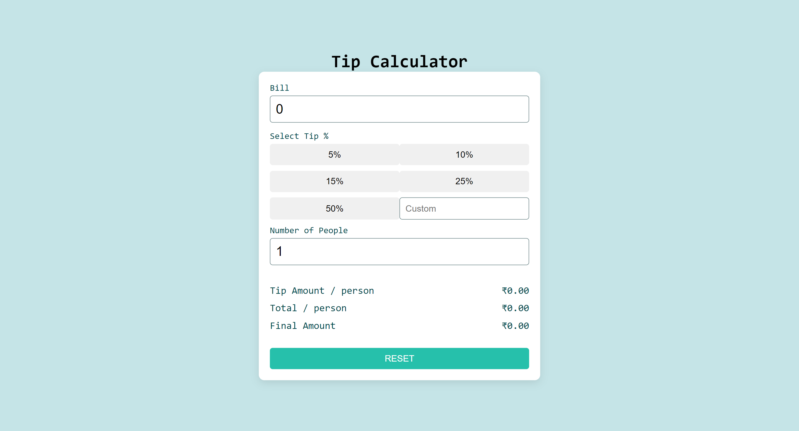

# Tip Calculator

This is a solution to the Tip Calculator app challenge on Frontend Mentor. The Tip Calculator app allows users to calculate the correct tip and total cost of the bill per person.

## Table of Contents

- [Overview](#overview)
  - [The Challenge](#the-challenge)
  - [Screenshot](#screenshot)
  - [Links](#links)
- [Built With](#built-with)
- [What I Learned](#what-i-learned)
- [Continued Development](#continued-development)
- [Author](#author)

## Overview

### The Challenge

The challenge was to create a Tip Calculator app that allows users to view the optimal layout for the app depending on their device's screen size, see hover states for all interactive elements on the page, and calculate the correct tip and total cost of the bill per person.

### Screenshot

### Links

- [Solution URL](https://github.com/Manojgupta103/Manoj-Gupta-Profile.git)
- [Live Site URL](https://tip-calculator-manoj.vercel.app/)

## Built With

- Semantic HTML5 markup
- CSS custom properties
- Flexbox
- CSS Grid
- Mobile-first workflow
- React - JS library
- Next.js - React framework
- Styled Components - For styles

## What I Learned

During this project, I learned how to create a responsive Tip Calculator app using HTML, CSS, and JavaScript. I also gained experience in using React, Next.js, and Styled Components to build the app.

## Continued Development

In future projects, I plan to further enhance my skills in frontend development and explore more advanced concepts and techniques.

## Author

- Website - [Manoj R Gupta](https://manoj-gupta-profile.vercel.app/)
- Frontend Mentor - [@yourusername](https://www.frontendmentor.io/profile/Manojgupta103)

